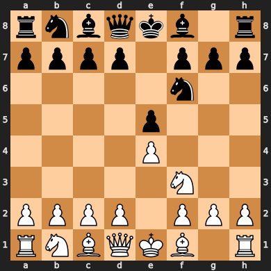

# Сыграем?

Создавайте ветки для новых партий (или ветвлений существующих с любого абсолютно хода), комитьте свой ход в [game.pgn](https://github.com/razonrus/chess_with_me/blob/main/game.pgn), ждите ответного хода :)
Если играете чёрными — бранчуйтесь от main-ветки.
Если белыми — то от [razonrus-black](https://github.com/razonrus/chess_with_me/tree/razonrus-black)

Текущая позиция в текущей ветке (картинка в кэше может обновиться не сразу, кликайте по ней :)): 

